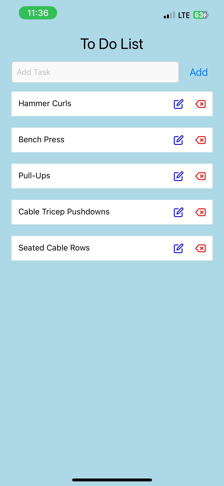

# Project: Profile Card

Project about a to do list and adding and deleting tasks from the front-end.

## Installation:

### Step 1: Install

Run a new terminal and run `npm i`

### Step 2: Install Expo

Download Expo Go

### Step 3: Start

In terminal, run `npx expo start`

### Step 4: Open

You should see a qr code in terminal, scan that with your phone and the app should automatically open.

